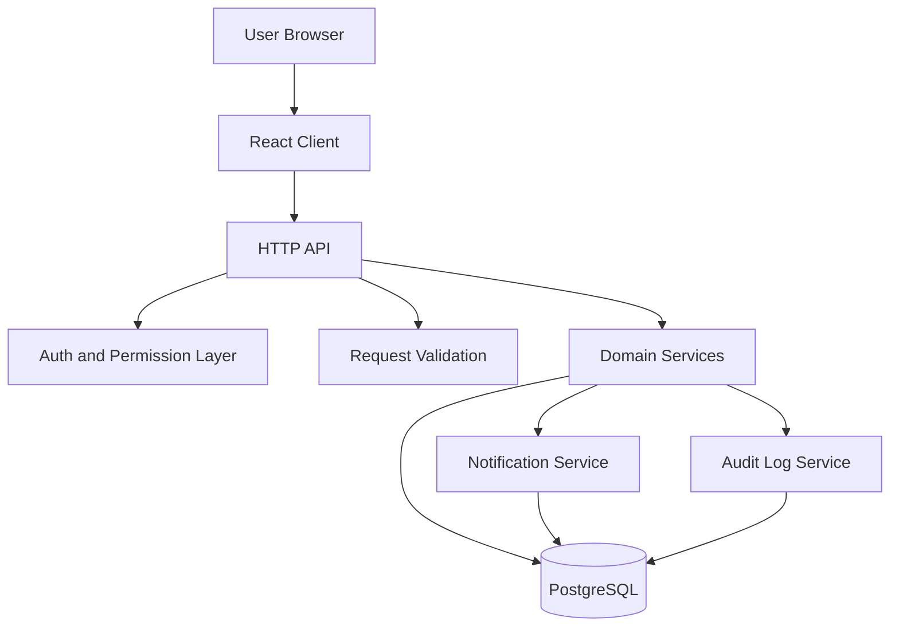

# Forenotes Phase 1 Architecture

## Purpose

This document describes the Phase 1 architecture for Forenotes. The system should be built from a fresh start with clean boundaries between UI, API, permissions, database persistence, and tests.

## Architecture Goals

1. Keep case and incident data strongly scoped.
2. Make server-side permission checks mandatory.
3. Support evidence-based findings.
4. Support global MITRE ATT&CK tags and case-scoped custom tags.
5. Keep UI workflows consistent through reusable tables and modals.
6. Make critical functionality browser-testable.
7. Avoid large files and large global stylesheets from the beginning.

## High-Level System



## Application Layers

### Client Layer

Responsibilities:

- Render case and incident workspace UI.
- Provide create/edit modals for main entities.
- Support filterable tables and inline editing where required.
- Show user-visible validation errors from the API.
- Show notification count and notification list.
- Hide unavailable actions based on user permissions returned by the API.

The client must not be trusted for authorization. All sensitive actions must be checked by the API.

### API Layer

Responsibilities:

- Authenticate the current user.
- Validate request bodies and query params.
- Resolve case and incident scope.
- Enforce permission checks.
- Call domain services.
- Return consistent error responses.

Recommended API shape:

```txt
/api/auth/*
/api/users/*
/api/cases/*
/api/cases/:caseId/members/*
/api/cases/:caseId/custom-tags/*
/api/incidents/*
/api/incidents/:incidentId/members/*
/api/incidents/:incidentId/findings/*
/api/incidents/:incidentId/timeline-events/*
/api/incidents/:incidentId/systems/*
/api/incidents/:incidentId/accounts/*
/api/incidents/:incidentId/indicators/*
/api/incidents/:incidentId/tasks/*
/api/incidents/:incidentId/queries/*
/api/incidents/:incidentId/search/*
/api/attack-tags/*
/api/notifications/*
/api/audit-logs/*
```

### Domain Service Layer

Domain services should hold business rules instead of putting all logic inside route handlers.

Suggested services:

```txt
caseService
incidentService
membershipService
permissionService
findingService
timelineEventService
evidenceLinkService
indicatorService
systemService
accountService
taskService
tagService
queryService
notificationService
auditLogService
searchService
```

Important service rules:

- `evidenceLinkService` must prevent cross-incident evidence links.
- `tagService` must separate global built-in MITRE tags from case-scoped custom tags.
- `taskService` must prevent linking entities from other incidents.
- `notificationService` must create per-recipient notification records.
- `auditLogService` should record security-relevant create/update/delete actions.

## Frontend Structure

Recommended structure:

```txt
src/client/
  app/
    AppRoot.tsx
    routes.tsx
    apiClient.ts
  auth/
    LoginPage.tsx
    RequireAuth.tsx
  cases/
    CaseListPage.tsx
    CaseModal.tsx
    CaseMembersModal.tsx
  incidents/
    IncidentWorkspacePage.tsx
    IncidentModal.tsx
    IncidentMembersModal.tsx
  findings/
    FindingsTable.tsx
    FindingModal.tsx
    FindingEvidencePanel.tsx
  timeline/
    TimelineTable.tsx
    TimelineEventModal.tsx
  evidence/
    EvidencePicker.tsx
    EvidenceLinksList.tsx
  indicators/
    IndicatorsTable.tsx
    IndicatorModal.tsx
  systems/
    SystemsTable.tsx
    SystemModal.tsx
  accounts/
    AccountsTable.tsx
    AccountModal.tsx
  tasks/
    TasksTable.tsx
    TaskModal.tsx
  queries/
    QueriesTable.tsx
    QueryModal.tsx
  tags/
    TagPicker.tsx
    CustomTagManager.tsx
    AttackTagPicker.tsx
  notifications/
    NotificationBell.tsx
    NotificationList.tsx
  shared/
    DataTable.tsx
    InlineEditableCell.tsx
    ModalShell.tsx
    FilterBar.tsx
    EntityBadge.tsx
  styles/
    base.css
    layout.css
    components.css
    workspace.css
    modals.css
    tables.css
```

## Backend Structure

Recommended structure:

```txt
src/server/
  app.ts
  routes/
    authRoutes.ts
    caseRoutes.ts
    incidentRoutes.ts
    findingRoutes.ts
    timelineEventRoutes.ts
    evidenceLinkRoutes.ts
    indicatorRoutes.ts
    taskRoutes.ts
    queryRoutes.ts
    tagRoutes.ts
    notificationRoutes.ts
    auditLogRoutes.ts
  services/
    permissionService.ts
    membershipService.ts
    caseService.ts
    incidentService.ts
    findingService.ts
    timelineEventService.ts
    evidenceLinkService.ts
    indicatorService.ts
    taskService.ts
    queryService.ts
    tagService.ts
    notificationService.ts
    auditLogService.ts
  db/
    pool.ts
    migrations/
    queries/
  validation/
    schemas.ts
  tests/
```

## Core Domain Model

```txt
Case
  contains Incidents
  contains Case Members
  contains Custom Tags

Incident
  belongs to Case
  contains Incident Members
  contains Findings
  contains Timeline Events
  contains Systems
  contains Accounts
  contains Indicators
  contains Tasks
  contains Queries

Finding
  represents analyst conclusion
  can be tagged with MITRE ATT&CK tags
  can be tagged with case custom tags
  can link to evidence entities

Evidence
  can be Timeline Event, System, Account, Indicator, Query, or future Attachment
  must belong to the same Incident as the Finding

Timeline Event
  represents chronological observation
  can support one or many Findings through evidence links

Indicator
  represents host, network, file, email, domain, URL, registry, process, or other IoC
  can support Findings through evidence links
```

## UI Workflow Pattern

Use a consistent Jira-style create/edit modal pattern.

For each major entity:

- Table/list page shows existing records.
- Filter bar is separate from the add button.
- Add button opens a modal.
- Clicking a row opens a detail/edit modal.
- Inline editing is available only where explicitly required.
- Save action calls the API and then refreshes or patches local state.
- API validation errors are shown inside the modal.

Entities that should use this pattern:

- Cases
- Incidents
- Findings
- Timeline events
- Systems
- Accounts
- Indicators
- Tasks
- Queries
- Custom tags

## Evidence Linking Pattern

Evidence linking should work from both directions:

1. From a finding modal, users can add or remove supporting evidence.
2. From a timeline event, indicator, system, or account modal, users can link that evidence to one or more findings.

Rules:

- Evidence picker must only show entities from the current incident.
- API must reject cross-incident evidence links.
- A duplicate link should be prevented by unique constraint.
- Linked evidence should be visible in finding detail.
- Linked findings should be visible in evidence detail.

## Tag Architecture

### Global MITRE ATT&CK Tags

- Built into the application through seed/import data.
- Available globally across all cases and incidents.
- Read-only for normal users.
- Used for tactics, techniques, sub-techniques, and related metadata.

### Custom Tags

- Created by users.
- Scoped to a case.
- Reusable across incidents inside that case.
- Not visible in other cases.
- Can be applied to findings and timeline events.

## Notification Architecture

Notifications are database-backed records.

Notification examples:

- User added to case.
- User added to incident.
- Task assigned to user.
- Finding created or updated in an incident where user is a member.
- Timeline event created or updated in an incident where user is a member.
- Indicator created or updated in an incident where user is a member.

Required state:

- `unseen = true` when created.
- `read_at` is null until read.
- Notification tab/bell shows count of unseen notifications.

## Error Strategy

Recommended API errors:

| Case | Status | Behavior |
|---|---:|---|
| Not authenticated | 401 | Prompt login |
| Authenticated but insufficient permission | 403 | Show permission error |
| Entity not found or outside accessible scope | 404 | Do not leak inaccessible records |
| Validation failure | 400 | Return field-level detail |
| Duplicate or invalid state transition | 409 | Explain conflict |
| Unexpected failure | 500 | Generic error plus server log |

## Phase 1 Non-Goals

Do not overbuild these in Phase 1 unless required:

- Full realtime collaboration cursors.
- Complex report generation.
- Attachment storage pipeline.
- Advanced SIEM integrations.
- Graph visualization.
- Multi-tenant billing or organizations.
- Fine-grained row-level PostgreSQL security unless already planned.

