# Forenotes Phase 1 Database Schema

## Purpose

This document defines the planned Phase 1 database schema for Forenotes. It is designed for a fresh implementation and should be used as the basis for migrations, API routes, permission checks, and browser-verifiable workflows.

## Schema Principles

1. Use UUID primary keys for business records.
2. Include `created_at` and `updated_at` on mutable tables.
3. Scope workspace data with `incident_id`.
4. Scope custom user-created tags with `case_id`.
5. Keep built-in MITRE ATT&CK tags global and read-only for normal users.
6. Model findings as analyst conclusions.
7. Model timeline events as chronological observations.
8. Model indicators as IoCs/evidence artifacts.
9. Use generic evidence links so findings can be supported by multiple evidence types.
10. Prevent cross-incident links at the API and database/service layer.
11. Store notification state per recipient.
12. Store audit logs for security-sensitive actions.

## Entity Relationship Diagram

```mermaid
erDiagram
    USERS {
        uuid id PK
        text email UK
        text display_name
        text global_role
        text status
        text password_hash
        timestamptz created_at
        timestamptz updated_at
    }

    PERMISSIONS {
        uuid id PK
        text key UK
        text description
    }

    ROLE_PERMISSIONS {
        text role PK
        text permission_key PK, FK
    }

    CASES {
        uuid id PK
        text case_name
        text client_name
        timestamptz start_date
        timestamptz end_date
        text status
        text summary
        uuid created_by_user_id FK
        timestamptz created_at
        timestamptz updated_at
    }

    CASE_MEMBERS {
        uuid case_id PK, FK
        uuid user_id PK, FK
        text case_role
        uuid added_by_user_id FK
        timestamptz added_at
    }

    INCIDENTS {
        uuid id PK
        uuid case_id FK
        text name
        text summary
        text severity
        text status
        uuid created_by_user_id FK
        timestamptz created_at
        timestamptz updated_at
    }

    INCIDENT_MEMBERS {
        uuid incident_id PK, FK
        uuid user_id PK, FK
        text incident_role
        uuid added_by_user_id FK
        timestamptz added_at
    }

    FINDINGS {
        uuid id PK
        uuid incident_id FK
        text title
        text description
        text severity
        text status
        text confidence
        text impact
        text recommendation
        uuid owner_user_id FK
        uuid created_by_user_id FK
        timestamptz created_at
        timestamptz updated_at
    }

    TIMELINE_EVENTS {
        uuid id PK
        uuid incident_id FK
        timestamptz event_time
        text title
        text description
        text source
        text raw_evidence_ref
        uuid owner_user_id FK
        uuid created_by_user_id FK
        timestamptz created_at
        timestamptz updated_at
    }

    SYSTEMS {
        uuid id PK
        uuid incident_id FK
        text hostname
        inet ip_address
        text os
        text owner
        text notes
        uuid created_by_user_id FK
        timestamptz created_at
        timestamptz updated_at
    }

    ACCOUNTS {
        uuid id PK
        uuid incident_id FK
        text username
        text domain
        text status
        text owner
        text notes
        uuid created_by_user_id FK
        timestamptz created_at
        timestamptz updated_at
    }

    INDICATORS {
        uuid id PK
        uuid incident_id FK
        text indicator_type
        text value
        text description
        text confidence
        text source
        timestamptz first_seen_at
        timestamptz last_seen_at
        uuid created_by_user_id FK
        timestamptz created_at
        timestamptz updated_at
    }

    FINDING_EVIDENCE_LINKS {
        uuid id PK
        uuid finding_id FK
        uuid incident_id FK
        text evidence_type
        uuid evidence_id
        uuid linked_by_user_id FK
        timestamptz created_at
    }

    TASKS {
        uuid id PK
        uuid incident_id FK
        text title
        text description
        text status
        text priority
        uuid owner_user_id FK
        uuid assignee_user_id FK
        uuid created_by_user_id FK
        timestamptz due_at
        timestamptz created_at
        timestamptz updated_at
    }

    TASK_LINKS {
        uuid id PK
        uuid task_id FK
        uuid incident_id FK
        text entity_type
        uuid entity_id
        timestamptz created_at
    }

    ATTACK_TAGS {
        uuid id PK
        text attack_id UK
        text name
        text type
        text parent_attack_id
        text description
        text platform
        text tactic
        text attack_version
        text external_url
        timestamptz created_at
        timestamptz updated_at
    }

    CUSTOM_TAGS {
        uuid id PK
        uuid case_id FK
        text name
        text color
        uuid created_by_user_id FK
        timestamptz created_at
        timestamptz updated_at
    }

    FINDING_ATTACK_TAGS {
        uuid finding_id PK, FK
        uuid attack_tag_id PK, FK
        uuid incident_id FK
        timestamptz created_at
    }

    FINDING_CUSTOM_TAGS {
        uuid finding_id PK, FK
        uuid custom_tag_id PK, FK
        uuid incident_id FK
        uuid case_id FK
        timestamptz created_at
    }

    TIMELINE_EVENT_ATTACK_TAGS {
        uuid timeline_event_id PK, FK
        uuid attack_tag_id PK, FK
        uuid incident_id FK
        timestamptz created_at
    }

    TIMELINE_EVENT_CUSTOM_TAGS {
        uuid timeline_event_id PK, FK
        uuid custom_tag_id PK, FK
        uuid incident_id FK
        uuid case_id FK
        timestamptz created_at
    }

    QUERIES {
        uuid id PK
        uuid incident_id FK
        text name
        text language
        text description
        text query_body
        uuid owner_user_id FK
        uuid created_by_user_id FK
        timestamptz created_at
        timestamptz updated_at
    }

    NOTIFICATIONS {
        uuid id PK
        uuid recipient_user_id FK
        uuid incident_id FK
        uuid actor_user_id FK
        text event_type
        text title
        text body
        text entity_type
        uuid entity_id
        boolean unseen
        timestamptz read_at
        timestamptz created_at
    }

    AUDIT_LOGS {
        uuid id PK
        uuid actor_user_id FK
        uuid case_id FK
        uuid incident_id FK
        text action
        text entity_type
        uuid entity_id
        jsonb before_json
        jsonb after_json
        jsonb metadata_json
        timestamptz created_at
    }

    USERS ||--o{ CASES : creates
    USERS ||--o{ CASE_MEMBERS : member
    USERS ||--o{ CASE_MEMBERS : added_by
    USERS ||--o{ INCIDENT_MEMBERS : member
    USERS ||--o{ INCIDENT_MEMBERS : added_by
    USERS ||--o{ FINDINGS : owns
    USERS ||--o{ FINDINGS : creates
    USERS ||--o{ TIMELINE_EVENTS : owns
    USERS ||--o{ TIMELINE_EVENTS : creates
    USERS ||--o{ SYSTEMS : creates
    USERS ||--o{ ACCOUNTS : creates
    USERS ||--o{ INDICATORS : creates
    USERS ||--o{ FINDING_EVIDENCE_LINKS : links
    USERS ||--o{ TASKS : owns
    USERS ||--o{ TASKS : assigned
    USERS ||--o{ TASKS : creates
    USERS ||--o{ CUSTOM_TAGS : creates
    USERS ||--o{ QUERIES : owns
    USERS ||--o{ QUERIES : creates
    USERS ||--o{ NOTIFICATIONS : receives
    USERS ||--o{ NOTIFICATIONS : acts
    USERS ||--o{ AUDIT_LOGS : acts

    PERMISSIONS ||--o{ ROLE_PERMISSIONS : grants

    CASES ||--o{ CASE_MEMBERS : has
    CASES ||--o{ INCIDENTS : contains
    CASES ||--o{ CUSTOM_TAGS : owns
    CASES ||--o{ FINDING_CUSTOM_TAGS : validates_scope
    CASES ||--o{ TIMELINE_EVENT_CUSTOM_TAGS : validates_scope
    CASES ||--o{ AUDIT_LOGS : scopes

    INCIDENTS ||--o{ INCIDENT_MEMBERS : has
    INCIDENTS ||--o{ FINDINGS : contains
    INCIDENTS ||--o{ TIMELINE_EVENTS : contains
    INCIDENTS ||--o{ SYSTEMS : contains
    INCIDENTS ||--o{ ACCOUNTS : contains
    INCIDENTS ||--o{ INDICATORS : contains
    INCIDENTS ||--o{ FINDING_EVIDENCE_LINKS : scopes
    INCIDENTS ||--o{ TASKS : contains
    INCIDENTS ||--o{ TASK_LINKS : scopes
    INCIDENTS ||--o{ FINDING_ATTACK_TAGS : filters
    INCIDENTS ||--o{ FINDING_CUSTOM_TAGS : filters
    INCIDENTS ||--o{ TIMELINE_EVENT_ATTACK_TAGS : filters
    INCIDENTS ||--o{ TIMELINE_EVENT_CUSTOM_TAGS : filters
    INCIDENTS ||--o{ QUERIES : contains
    INCIDENTS ||--o{ NOTIFICATIONS : scopes
    INCIDENTS ||--o{ AUDIT_LOGS : scopes

    FINDINGS ||--o{ FINDING_EVIDENCE_LINKS : has_evidence
    TIMELINE_EVENTS ||..o{ FINDING_EVIDENCE_LINKS : can_support
    SYSTEMS ||..o{ FINDING_EVIDENCE_LINKS : can_support
    ACCOUNTS ||..o{ FINDING_EVIDENCE_LINKS : can_support
    INDICATORS ||..o{ FINDING_EVIDENCE_LINKS : can_support
    QUERIES ||..o{ FINDING_EVIDENCE_LINKS : can_support

    TASKS ||--o{ TASK_LINKS : links_to_entities

    FINDINGS ||--o{ FINDING_ATTACK_TAGS : tagged_with
    ATTACK_TAGS ||--o{ FINDING_ATTACK_TAGS : applies_to
    FINDINGS ||--o{ FINDING_CUSTOM_TAGS : tagged_with
    CUSTOM_TAGS ||--o{ FINDING_CUSTOM_TAGS : applies_to

    TIMELINE_EVENTS ||--o{ TIMELINE_EVENT_ATTACK_TAGS : tagged_with
    ATTACK_TAGS ||--o{ TIMELINE_EVENT_ATTACK_TAGS : applies_to
    TIMELINE_EVENTS ||--o{ TIMELINE_EVENT_CUSTOM_TAGS : tagged_with
    CUSTOM_TAGS ||--o{ TIMELINE_EVENT_CUSTOM_TAGS : applies_to
```



## Tables

## users

Stores application users.

| Column | Type | Required | Notes |
|---|---:|---:|---|
| id | uuid | yes | Primary key |
| email | text | yes | Unique |
| display_name | text | yes | User-visible name |
| global_role | text | yes | `commander`, `response_lead`, `analyst` |
| status | text | yes | `active`, `disabled` |
| password_hash | text | no | Required only for local auth |
| created_at | timestamptz | yes | Default now |
| updated_at | timestamptz | yes | Default now |

## permissions

Stores available permission keys.

| Column | Type | Required | Notes |
|---|---:|---:|---|
| id | uuid | yes | Primary key |
| key | text | yes | Unique permission key |
| description | text | no | Human-readable description |

Example permission keys:

```txt
case:create
case:update
case:member_manage
incident:create
incident:update
incident:member_manage
finding:create
finding:update
finding:delete
finding:evidence_link
finding:evidence_unlink
timeline:create
timeline:update
timeline:delete
indicator:create
indicator:update
indicator:delete
task:create
task:update
task:assign
task:link
query:create
query:update
query:delete
tag:custom_create
tag:custom_update
notification:read
audit:read
```

## role_permissions

Maps global roles to permission keys.

| Column | Type | Required | Notes |
|---|---:|---:|---|
| role | text | yes | Role name |
| permission_key | text | yes | FK to permissions.key |

Primary key:

- `(role, permission_key)`

## cases

Top-level investigation container.

| Column | Type | Required | Notes |
|---|---:|---:|---|
| id | uuid | yes | Primary key |
| case_name | text | yes | Case name |
| client_name | text | no | Client or organization |
| start_date | timestamptz | no | Case start |
| end_date | timestamptz | no | Case end |
| status | text | yes | `open`, `closed` |
| summary | text | no | Case summary |
| created_by_user_id | uuid | yes | FK to users.id |
| created_at | timestamptz | yes | Default now |
| updated_at | timestamptz | yes | Default now |

## case_members

Users assigned to a case.

| Column | Type | Required | Notes |
|---|---:|---:|---|
| case_id | uuid | yes | FK to cases.id |
| user_id | uuid | yes | FK to users.id |
| case_role | text | yes | Example: `case_lead`, `member` |
| added_by_user_id | uuid | yes | FK to users.id |
| added_at | timestamptz | yes | Default now |

Primary key:

- `(case_id, user_id)`

## incidents

Incident workspace inside a case.

| Column | Type | Required | Notes |
|---|---:|---:|---|
| id | uuid | yes | Primary key |
| case_id | uuid | yes | FK to cases.id |
| name | text | yes | Incident name |
| summary | text | no | Incident summary |
| severity | text | no | `low`, `medium`, `high`, `critical` |
| status | text | yes | `open`, `closed`, `contained`, etc. |
| created_by_user_id | uuid | yes | FK to users.id |
| created_at | timestamptz | yes | Default now |
| updated_at | timestamptz | yes | Default now |

## incident_members

Users assigned to an incident.

| Column | Type | Required | Notes |
|---|---:|---:|---|
| incident_id | uuid | yes | FK to incidents.id |
| user_id | uuid | yes | FK to users.id |
| incident_role | text | yes | Example: `incident_lead`, `analyst` |
| added_by_user_id | uuid | yes | FK to users.id |
| added_at | timestamptz | yes | Default now |

Primary key:

- `(incident_id, user_id)`

## findings

Analyst conclusions. Findings should be reportable and supported by evidence.

| Column | Type | Required | Notes |
|---|---:|---:|---|
| id | uuid | yes | Primary key |
| incident_id | uuid | yes | FK to incidents.id |
| title | text | yes | Finding title |
| description | text | no | Analyst explanation |
| severity | text | no | `low`, `medium`, `high`, `critical` |
| status | text | yes | `draft`, `confirmed`, `false_positive`, `resolved` |
| confidence | text | no | `low`, `medium`, `high` |
| impact | text | no | Business or technical impact |
| recommendation | text | no | Recommended remediation |
| owner_user_id | uuid | no | FK to users.id |
| created_by_user_id | uuid | yes | FK to users.id |
| created_at | timestamptz | yes | Default now |
| updated_at | timestamptz | yes | Default now |

## timeline_events

Chronological observations or investigation events.

| Column | Type | Required | Notes |
|---|---:|---:|---|
| id | uuid | yes | Primary key |
| incident_id | uuid | yes | FK to incidents.id |
| event_time | timestamptz | yes | When the event occurred |
| title | text | yes | Event summary |
| description | text | no | Details |
| source | text | no | Log source, tool, analyst, etc. |
| raw_evidence_ref | text | no | Optional external/raw reference |
| owner_user_id | uuid | no | FK to users.id |
| created_by_user_id | uuid | yes | FK to users.id |
| created_at | timestamptz | yes | Default now |
| updated_at | timestamptz | yes | Default now |

## systems

Hosts, servers, endpoints, or infrastructure entities involved in an incident.

| Column | Type | Required | Notes |
|---|---:|---:|---|
| id | uuid | yes | Primary key |
| incident_id | uuid | yes | FK to incidents.id |
| hostname | text | yes | Hostname or asset name |
| ip_address | inet | no | IP address |
| os | text | no | Operating system |
| owner | text | no | Business or technical owner |
| notes | text | no | Analyst notes |
| created_by_user_id | uuid | yes | FK to users.id |
| created_at | timestamptz | yes | Default now |
| updated_at | timestamptz | yes | Default now |

## accounts

User/service accounts involved in an incident.

| Column | Type | Required | Notes |
|---|---:|---:|---|
| id | uuid | yes | Primary key |
| incident_id | uuid | yes | FK to incidents.id |
| username | text | yes | Account username |
| domain | text | no | Domain, tenant, or identity provider |
| status | text | no | Example: `active`, `disabled`, `compromised`, `unknown` |
| owner | text | no | Person/team owner |
| notes | text | no | Analyst notes |
| created_by_user_id | uuid | yes | FK to users.id |
| created_at | timestamptz | yes | Default now |
| updated_at | timestamptz | yes | Default now |

## indicators

Indicators of compromise or investigation artifacts.

| Column | Type | Required | Notes |
|---|---:|---:|---|
| id | uuid | yes | Primary key |
| incident_id | uuid | yes | FK to incidents.id |
| indicator_type | text | yes | `host`, `ip`, `domain`, `url`, `email`, `file_hash`, `registry`, `mutex`, `process`, etc. |
| value | text | yes | Indicator value |
| description | text | no | Analyst notes |
| confidence | text | no | `low`, `medium`, `high` |
| source | text | no | Where the indicator came from |
| first_seen_at | timestamptz | no | Optional first observed time |
| last_seen_at | timestamptz | no | Optional last observed time |
| created_by_user_id | uuid | yes | FK to users.id |
| created_at | timestamptz | yes | Default now |
| updated_at | timestamptz | yes | Default now |

Recommended unique index:

- `(incident_id, indicator_type, value)`

## finding_evidence_links

Generic evidence links connecting findings to supporting evidence.

| Column | Type | Required | Notes |
|---|---:|---:|---|
| id | uuid | yes | Primary key |
| finding_id | uuid | yes | FK to findings.id |
| incident_id | uuid | yes | FK to incidents.id |
| evidence_type | text | yes | `timeline_event`, `system`, `account`, `indicator`, `query`, future `attachment` |
| evidence_id | uuid | yes | ID of the evidence entity |
| linked_by_user_id | uuid | yes | FK to users.id |
| created_at | timestamptz | yes | Default now |

Recommended unique constraint:

- `(finding_id, evidence_type, evidence_id)`

Rules:

- Evidence must belong to the same incident as the finding.
- Cross-incident evidence links are not allowed.
- API/service layer must validate `evidence_type` and `evidence_id`.
- Duplicate evidence links are not allowed.

Note: `evidence_id` is polymorphic, so PostgreSQL cannot enforce a normal FK to every possible evidence table. Enforce this with service-level validation and tests.

## tasks

Work items for the incident.

| Column | Type | Required | Notes |
|---|---:|---:|---|
| id | uuid | yes | Primary key |
| incident_id | uuid | yes | FK to incidents.id |
| title | text | yes | Task title |
| description | text | no | Task detail |
| status | text | yes | `todo`, `in_progress`, `blocked`, `done` |
| priority | text | no | `low`, `medium`, `high`, `urgent` |
| owner_user_id | uuid | no | FK to users.id |
| assignee_user_id | uuid | no | FK to users.id |
| created_by_user_id | uuid | yes | FK to users.id |
| due_at | timestamptz | no | Optional due date |
| created_at | timestamptz | yes | Default now |
| updated_at | timestamptz | yes | Default now |

Do not include a `ready` status in Phase 1.

## task_links

Links tasks to incident-scoped entities.

| Column | Type | Required | Notes |
|---|---:|---:|---|
| id | uuid | yes | Primary key |
| task_id | uuid | yes | FK to tasks.id |
| incident_id | uuid | yes | FK to incidents.id |
| entity_type | text | yes | `finding`, `timeline_event`, `system`, `account`, `indicator`, `query` |
| entity_id | uuid | yes | Linked entity ID |
| created_at | timestamptz | yes | Default now |

Rules:

- Linked entity must belong to the same incident as the task.
- Cross-incident task links are not allowed.

## attack_tags

Built-in global MITRE ATT&CK tag catalog.

| Column | Type | Required | Notes |
|---|---:|---:|---|
| id | uuid | yes | Primary key |
| attack_id | text | yes | Unique MITRE ID, such as `T1003` |
| name | text | yes | Technique/tactic name |
| type | text | yes | `tactic`, `technique`, `subtechnique` |
| parent_attack_id | text | no | Parent MITRE ID |
| description | text | no | MITRE description |
| platform | text | no | Platform metadata |
| tactic | text | no | Related tactic |
| attack_version | text | no | ATT&CK version |
| external_url | text | no | MITRE URL |
| created_at | timestamptz | yes | Default now |
| updated_at | timestamptz | yes | Default now |

Rules:

- Available globally.
- Seeded/imported by the application.
- Read-only for normal users.
- Can be applied across cases and incidents.

## custom_tags

User-created case-scoped tags.

| Column | Type | Required | Notes |
|---|---:|---:|---|
| id | uuid | yes | Primary key |
| case_id | uuid | yes | FK to cases.id |
| name | text | yes | Tag label |
| color | text | no | UI color token or hex value |
| created_by_user_id | uuid | yes | FK to users.id |
| created_at | timestamptz | yes | Default now |
| updated_at | timestamptz | yes | Default now |

Recommended unique index:

- `(case_id, lower(name))`

Rules:

- Custom tags are visible only inside their case.
- Custom tags can be reused across incidents inside the same case.
- Custom tags from another case cannot be attached.

## finding_attack_tags

MITRE tags attached to findings.

Primary key:

- `(finding_id, attack_tag_id)`

Columns:

| Column | Type | Required | Notes |
|---|---:|---:|---|
| finding_id | uuid | yes | FK to findings.id |
| attack_tag_id | uuid | yes | FK to attack_tags.id |
| incident_id | uuid | yes | FK to incidents.id, denormalized for filtering |
| created_at | timestamptz | yes | Default now |

## finding_custom_tags

Case custom tags attached to findings.

Primary key:

- `(finding_id, custom_tag_id)`

Columns:

| Column | Type | Required | Notes |
|---|---:|---:|---|
| finding_id | uuid | yes | FK to findings.id |
| custom_tag_id | uuid | yes | FK to custom_tags.id |
| incident_id | uuid | yes | FK to incidents.id, denormalized for filtering |
| case_id | uuid | yes | FK to cases.id, used to validate scope |
| created_at | timestamptz | yes | Default now |

## timeline_event_attack_tags

MITRE tags attached to timeline events.

Primary key:

- `(timeline_event_id, attack_tag_id)`

## timeline_event_custom_tags

Case custom tags attached to timeline events.

Primary key:

- `(timeline_event_id, custom_tag_id)`

## queries

Reusable investigation queries.

| Column | Type | Required | Notes |
|---|---:|---:|---|
| id | uuid | yes | Primary key |
| incident_id | uuid | yes | FK to incidents.id |
| name | text | yes | Query name |
| language | text | yes | `kql`, `spl`, `sql`, `sigma`, etc. |
| description | text | no | Query description |
| query_body | text | yes | Full query text |
| owner_user_id | uuid | no | FK to users.id |
| created_by_user_id | uuid | yes | FK to users.id |
| created_at | timestamptz | yes | Default now |
| updated_at | timestamptz | yes | Default now |

## notifications

Per-user notification records.

| Column | Type | Required | Notes |
|---|---:|---:|---|
| id | uuid | yes | Primary key |
| recipient_user_id | uuid | yes | FK to users.id |
| incident_id | uuid | no | FK to incidents.id when relevant |
| actor_user_id | uuid | no | FK to users.id |
| event_type | text | yes | Notification type |
| title | text | yes | Display title |
| body | text | no | Display body |
| entity_type | text | no | Related entity type |
| entity_id | uuid | no | Related entity id |
| unseen | boolean | yes | Default true |
| read_at | timestamptz | no | Set when read |
| created_at | timestamptz | yes | Default now |

## audit_logs

Security and data-change audit history.

| Column | Type | Required | Notes |
|---|---:|---:|---|
| id | uuid | yes | Primary key |
| actor_user_id | uuid | no | FK to users.id |
| case_id | uuid | no | FK to cases.id |
| incident_id | uuid | no | FK to incidents.id |
| action | text | yes | `create`, `update`, `delete`, `assign`, `link`, etc. |
| entity_type | text | yes | Entity changed |
| entity_id | uuid | no | Entity id |
| before_json | jsonb | no | Snapshot before change |
| after_json | jsonb | no | Snapshot after change |
| metadata_json | jsonb | no | Extra request metadata |
| created_at | timestamptz | yes | Default now |

## Recommended Indexes

```sql
CREATE INDEX idx_cases_status ON cases(status);
CREATE INDEX idx_case_members_user_id ON case_members(user_id);
CREATE INDEX idx_incidents_case_id ON incidents(case_id);
CREATE INDEX idx_incident_members_user_id ON incident_members(user_id);
CREATE INDEX idx_findings_incident_id ON findings(incident_id);
CREATE INDEX idx_timeline_events_incident_time ON timeline_events(incident_id, event_time DESC);
CREATE INDEX idx_systems_incident_id ON systems(incident_id);
CREATE INDEX idx_accounts_incident_id ON accounts(incident_id);
CREATE INDEX idx_indicators_incident_type_value ON indicators(incident_id, indicator_type, value);
CREATE INDEX idx_finding_evidence_finding_id ON finding_evidence_links(finding_id);
CREATE INDEX idx_finding_evidence_incident_type ON finding_evidence_links(incident_id, evidence_type);
CREATE INDEX idx_tasks_incident_id ON tasks(incident_id);
CREATE INDEX idx_tasks_assignee_user_id ON tasks(assignee_user_id);
CREATE INDEX idx_custom_tags_case_id ON custom_tags(case_id);
CREATE INDEX idx_attack_tags_attack_id ON attack_tags(attack_id);
CREATE INDEX idx_queries_incident_id ON queries(incident_id);
CREATE INDEX idx_notifications_recipient_unseen ON notifications(recipient_user_id, unseen, created_at DESC);
CREATE INDEX idx_audit_logs_incident_id ON audit_logs(incident_id, created_at DESC);
```

## Validation Rules That Must Be Tested

- Non-members cannot access incident-scoped records.
- Custom tags cannot cross case boundaries.
- MITRE ATT&CK tags are globally selectable.
- Finding evidence links cannot cross incident boundaries.
- Task links cannot cross incident boundaries.
- Task assignment requires task assignment permission.
- Notification records are visible only to the recipient.
- Global search results must include case and incident context.

